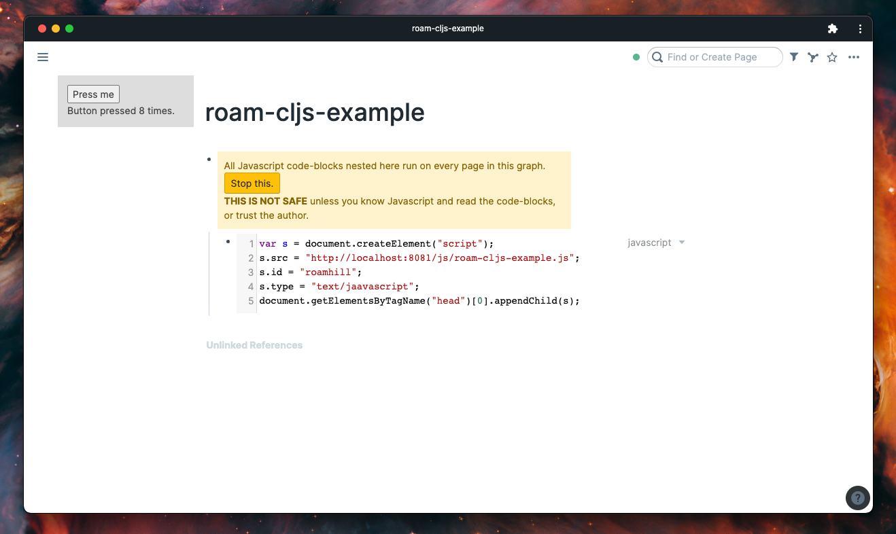

A very rough template for starting a ClojureScript JS extension for Roam.

# setup

- run `yarn install` to get JavaScript dependencies
- run `shadow-cljs watch roam-cljs-example` to start building project
- create a new page to test on in Roam
- add a `{{[[roam/js]]}}` block to the test page, and under that block add the following JavaScript snippt to load the ClojureScript output

```javascript
var s = document.createElement("script");
s.src = "http://localhost:8081/js/roam-cljs-example.js";
s.id = "roamhill";
s.type = "text/javascript";
document.getElementsByTagName("head")[0].appendChild(s);
```

# example test page


